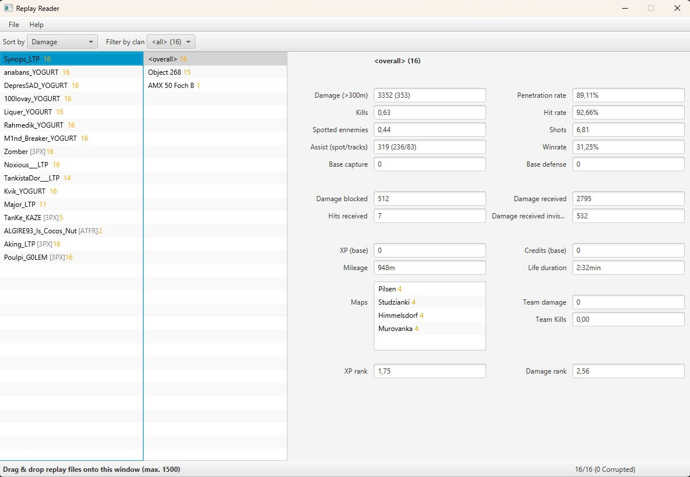

# Replay Reader

[](https://github.com/synopss/replay-reader/releases/latest)
[](https://github.com/synopss/replay-reader/releases/latest)
[](https://github.com/synopss/replay-reader/blob/master/LICENSE)
[](https://github.com/synopss/replay-reader/discussions)

**Replay Reader** is a World of Tanks replay analysis tool focusing on important statics to help competitive teams to better understand their player performances.



---

## Releases

Latest release [here](https://github.com/synopss/replay-reader/releases/latest).

## Getting Help

- [Discussions](https://github.com/synopss/replay-reader/discussions)
- [Issues](https://github.com/synopss/replay-reader/issues)

## Documentation

### Tanks
To update the tanks' list, first update the `.\tools\tanks.json` by running the Wargaming's API with those parameters and your API key:
```
https://api.worldoftanks.eu/wot/encyclopedia/vehicles/?application_id={{application_key}}&fields=name%2Ctag%2Cnation
```

you need to run the command to convert the json output into a readable properties file for the application:
```bash
python .\tools\tanks-exporter.py .\tools\tanks.json .\src\main\resources\tanks.properties
```

### Maps
To update the maps' list, you usually would run the Wargaming's API with those parameters for your locale and your API key:
```
https://api.worldoftanks.eu/wot/encyclopedia/arenas/?application_id={{application_key}}&fields=arena_id%2Cname_i18n
```

But it hasn't been updated for a while, so the best solution remains to fetch that data from the game client directly using that [repository](https://github.com/synopss/wot-map-extractor) using the json output.

## Development

- If you are willing to contribute, please read our guidelines for [contributing](CONTRIBUTING.md).
- Please read and follow our [code of conduct](CODE_OF_CONDUCT.md).